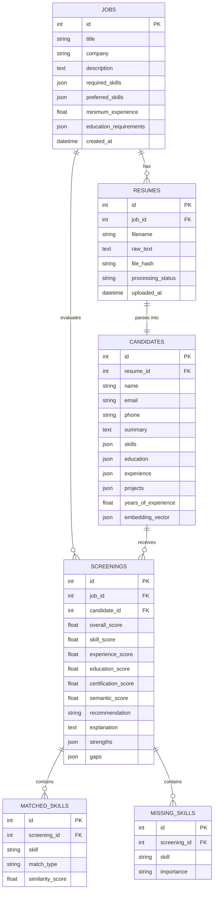

# Smart Resume Screener (AI-Powered Candidate Ranking & Evaluation System)

[](https://fastapi.tiangolo.com)
[](https://reactjs.org)
[](https://www.postgresql.org)
[](https://www.docker.com)
[](https://opensource.org/licenses/MIT)

> An enterprise-grade, explainable AI Resume Screening and Candidate Ranking System that accepts job descriptions and PDF resumes, extracts structured data, computes deterministic candidate-job match scores, utilizes an LLM provider abstraction for qualitative evaluation, stores relational data in PostgreSQL, and delivers a modern recruiter dashboard.

---

## 🎥 Workflow Video Demo


---

## Table of Contents
1. [Workflow Video Demo](#-workflow-video-demo)
2. [Project Overview](#1-project-overview)
3. [Problem Statement](#2-problem-statement)
4. [Objectives](#3-objectives)
5. [Features](#4-features)
6. [Architecture](#5-architecture)
7. [Tech Stack](#6-tech-stack)
8. [Folder Structure](#7-folder-structure)
9. [Database Design](#8-database-design)
10. [AI/ML Pipeline](#9-aiml-pipeline)
11. [Matching Algorithm](#10-matching-algorithm)
12. [Scoring Formula](#11-scoring-formula)
13. [LLM Prompt Strategy](#12-llm-prompt-strategy)
14. [API Documentation](#13-api-documentation)
15. [Setup Instructions](#14-setup-instructions)
16. [Environment Variables](#15-environment-variables)
17. [Local Development](#16-local-development)
18. [Testing](#17-testing)
19. [Demo Flow](#18-demo-flow)
20. [Limitations](#19-limitations)
21. [Future Improvements](#20-future-improvements)
22. [Fairness and Bias Note](#21-fairness-and-bias-note)

---

## 1. Project Overview

**Smart Resume Screener** solves the traditional recruiter bottleneck of manually reviewing hundreds of unstructured PDF resumes against complex job requisitions. Unlike black-box AI tools that output opaque match scores, this platform combines a **deterministic 6-stage mathematical scoring engine** with **LLM structured qualitative justification** to produce transparent, explainable, and bias-resistant hiring insights.

---

## 2. Problem Statement

Recruiters spend an average of 6 to 8 seconds per resume, frequently overlooking qualified candidates or falling victim to cognitive bias. Conversely, existing ATS tools rely on simplistic keyword matching or opaque LLM prompts that hallucinate scores. Hiring teams need an automated solution that provides:
- High-fidelity PDF information extraction.
- Deterministic, verifiable, and transparent mathematical scoring.
- Grounded qualitative evidence citing specific candidate achievements.
- Strict isolation of protected demographic attributes.

---

## 3. Objectives

- **Explainability**: Every score is calculated via transparent sub-scores (Skills 40%, Experience 25%, Semantic Relevance 20%, Education 10%, Certifications 5%).
- **Multi-Stage Matching**: Exact token matching, semantic technology alias clustering, experience seniority scaling, and degree hierarchy analysis.
- **Provider Flexibility**: Pluggable `LLMProvider` abstraction supporting `OpenAIProvider` and zero-cost offline `MockLLMProvider`.
- **Modern Recruiter Experience**: Rich, responsive React + TypeScript dashboard with score gauges, candidate leaderboards, and detailed profile breakdowns.

---

## 4. Features

- **Multi-File PDF & TXT Ingestion**: Fast extraction using PyMuPDF (`fitz`), with image-only/scanned PDF detection and duplicate prevention via SHA-256 content hashing.
- **AI Job Structuring**: Automatic parsing of job descriptions into mandatory required skills, preferred bonus skills, minimum experience, and degree requirements.
- **Deterministic 1.0 – 10.0 Scoring Engine**: Transparent weighted scoring mapped to standard recruiter shortlisting thresholds (`SHORTLIST`, `REVIEW`, `NOT_RECOMMENDED`).
- **Interactive Recruiter Dashboard**: High-level KPIs, job requisition creator with preloaded demo templates, drag-and-drop resume upload zone, and candidate inspection cards.
- **Demographic Bias Protection**: Automatic regex redaction and prompt-level isolation of gender, age, race, religion, marital status, and nationality.

---

## 5. Architecture

```
                                  ┌────────────────────────┐
                                  │   Recruiter Dashboard  │
                                  │   (React + TypeScript) │
                                  └───────────┬────────────┘
                                              │ REST API
                                  ┌───────────▼────────────┐
                                  │    FastAPI Backend     │
                                  └───────────┬────────────┘
             ┌────────────────────────────────┼────────────────────────────────┐
             │                                │                                │
┌────────────▼────────────┐      ┌────────────▼────────────┐      ┌────────────▼────────────┐
│   PyMuPDF & Cleaner     │      │   Deterministic Matcher  │      │  LLM Provider (Pluggable)│
│ • Text Extraction       │      │ • 40% Skills (Exact/Sem)│      │ • OpenAI GPT-4o-mini    │
│ • PII Demographic Strip │      │ • 25% Experience Curve  │      │ • Offline Mock Engine   │
│ • Section Segmentation  │      │ • 20% Semantic Vectors  │      │ • Strict Pydantic JSON  │
└─────────────────────────┘      │ • 10% Education Match   │      └─────────────────────────┘
                                 │ • 5% Certifications     │
                                 └────────────┬────────────┘
                                              │
                                 ┌────────────▼────────────┐
                                 │  PostgreSQL / SQLite    │
                                 │ Relational + JSONB Data │
                                 └─────────────────────────┘
```

---

## 6. Tech Stack

- **Backend**: Python 3.11+, FastAPI, Pydantic v2, SQLAlchemy 2.0, Alembic, PyMuPDF, NumPy, ReportLab, pytest, Ruff.
- **Frontend**: React 18, TypeScript, Vite, Tailwind CSS, Lucide React, Axios.
- **Database**: PostgreSQL 15 (Docker / Production), SQLite (Local zero-dependency fallback).
- **AI / NLP**: OpenAI API (`gpt-4o-mini`, `text-embedding-3-small`) + Local deterministic subword n-gram vectorizer.

---

## 7. Folder Structure

```text
smart-resume-screener/
├── backend/
│   ├── app/
│   │   ├── api/routes/          # REST endpoints (health, jobs, resumes, candidates, screening)
│   │   ├── core/                # Settings, logging, security, custom exceptions
│   │   ├── db/                  # Database engine, session, Alembic migrations
│   │   ├── models/              # SQLAlchemy ORM models (Job, Resume, Candidate, Screening, SkillMatch)
│   │   ├── prompts/             # Dedicated LLM prompt templates with strict JSON contracts
│   │   ├── repositories/        # Data access layer
│   │   ├── schemas/             # Pydantic schemas (domain entities & LLM outputs)
│   │   ├── services/            # Business logic (PDF parser, matcher, scoring, ranking, LLM service)
│   │   └── utils/               # File validation, safe JSON repair, retry decorators
│   ├── tests/                   # 28 automated unit and integration tests
│   ├── Dockerfile
│   └── pyproject.toml
├── frontend/
│   ├── src/
│   │   ├── components/          # Reusable UI (ScoreGauge, Badges, RankingTable, Dropzone)
│   │   ├── pages/               # Dashboard, CreateJob, JobDetails, UploadResumes, Rankings, CandidateDetails
│   │   ├── services/            # Axios API services
│   │   └── types/               # TypeScript interfaces
│   ├── Dockerfile
│   └── vite.config.ts
├── docs/                        # In-depth architectural and algorithmic specifications
├── sample_data/                 # Realistic sample jobs and 5 PDF candidate resumes
├── scripts/                     # PDF generator and database demo seeder
├── docker-compose.yml
└── .env.example
```

---

## 8. Database Design



---

## 9. AI/ML Pipeline

1. **Document Ingestion**: PyMuPDF extracts text streams and validates embedded fonts.
2. **Sanitization**: Unicode normalization, bullet standardizer, and demographic attribute filtering.
3. **Structured Extraction**: LLM (or Mock Provider) populates structured Pydantic schemas separating explicit from inferred skills.
4. **Vector Embedding**: Generates dense embedding representations of candidate profiles and job descriptions.
5. **Multi-Stage Matching**: Computes exact and semantic skill overlap, seniority fulfillment, and education hierarchy.
6. **Deterministic Scoring**: Weights sub-scores mathematically to produce overall score (1.0 - 10.0).
7. **Qualitative Synthesis**: LLM produces evidence-grounded commentary citing specific strengths and gaps.

---

## 10. Matching Algorithm

- **Exact Skill Matching**: Token normalization, casing, and punctuation standardization.
- **Semantic Skill Matching**: Canonical alias dictionary + skill family clusters (e.g., `PostgreSQL` matches `SQL Database`, `React.js` matches `React`, `Docker` matches `Kubernetes` with semantic bonus).
- **Experience Seniority Curve**: Proportional scaling comparing candidate verified career years against minimum role requirements.
- **Education Hierarchy**: Evaluates qualification level ($PhD > Master's > Bachelor's > Associate > None$).
- **Certification Alignment**: Verification of industry certifications.

---

## 11. Scoring Formula

$$\text{Overall Score} = \max\left(1.0, \min\left(10.0, \text{round}\left(\frac{0.40 S_{\text{skill}} + 0.25 S_{\text{exp}} + 0.20 S_{\text{sem}} + 0.10 S_{\text{edu}} + 0.05 S_{\text{cert}}}{10}, 1\right)\right)\right)$$

### Recommendation Thresholds
- **Score $\ge 7.0$**: `SHORTLIST` (Green)
- **Score $5.0 - 6.9$**: `REVIEW` (Amber)
- **Score $< 5.0$**: `NOT_RECOMMENDED` (Rose)

---

## 12. LLM Prompt Strategy

Dedicated prompt modules reside in `backend/app/prompts/`:
1. `resume_extraction.py`: Strict JSON schema extraction, forbidding hallucinated information.
2. `job_extraction.py`: Differentiates mandatory required from preferred bonus skills.
3. `candidate_matching.py`: Evidence-based qualitative evaluation citing specific candidate background.

---

## 13. API Documentation

| Method | Endpoint | Description |
| :--- | :--- | :--- |
| `GET` | `/api/health` | System health and LLM provider status |
| `POST` | `/api/jobs` | Create job requisition with optional auto-extraction |
| `GET` | `/api/jobs` | List all job requisitions |
| `GET` | `/api/jobs/{id}` | Get job requisition details |
| `POST` | `/api/jobs/{id}/resumes` | Upload multi-file PDF/TXT resumes |
| `GET` | `/api/jobs/{id}/resumes` | List resumes for a job |
| `POST` | `/api/jobs/{id}/screen` | Trigger screening and candidate ranking |
| `GET` | `/api/jobs/{id}/rankings` | Get ranked candidate leaderboard |
| `GET` | `/api/candidates/{id}` | Retrieve candidate profile and evaluation |
| `GET` | `/api/screenings/{id}` | Get individual screening breakdown |

---

## 14. Setup Instructions

### Prerequisites
- Python 3.11+
- Node.js 18+ and npm
- Docker and Docker Compose (optional for containerized deployment)

### 1. Clone & Configure Environment
```bash
git clone https://github.com/your-org/smart-resume-screener.git
cd smart-resume-screener
cp .env.example .env
```

---

## 15. Environment Variables

| Variable | Default | Description |
| :--- | :--- | :--- |
| `DATABASE_URL` | `sqlite:///./resume_screener.db` | PostgreSQL or SQLite connection string |
| `LLM_MODE` | `mock` | `mock` (zero-cost local) or `real` (OpenAI API) |
| `OPENAI_API_KEY` | `""` | OpenAI API Key (required only if `LLM_MODE=real`) |
| `OPENAI_MODEL` | `gpt-4o-mini` | OpenAI Chat model |
| `OPENAI_EMBEDDING_MODEL` | `text-embedding-3-small` | OpenAI Embeddings model |
| `SHORTLIST_THRESHOLD` | `7.0` | Threshold for SHORTLIST recommendation |
| `REVIEW_THRESHOLD` | `5.0` | Threshold for REVIEW recommendation |

---

## 16. Local Development

### Option A: Running with Docker Compose (Full Stack)
```bash
docker compose up --build
```
- Frontend: `http://localhost:3000`
- Backend API: `http://localhost:8000`
- Swagger Docs: `http://localhost:8000/docs`

### Option B: Running Standalone Locally

**1. Backend:**
```bash
cd backend
pip install -r requirements.txt
uvicorn app.main:app --reload --port 8000
```

**2. Frontend:**
```bash
cd frontend
npm install
npm run dev
```

**3. Seed Demo Data (Optional):**
```bash
python scripts/seed_demo_data.py
```

---

## 17. Testing

Run the automated test suite covering PDF parsing, text cleaning, matching algorithms, scoring formulas, and API routes:

```bash
pytest backend/tests -v
```

---

## 18. Demo Flow

> 🎥 **Video Walkthrough**: See the workflow demo animation in [Workflow Video Demo](#-workflow-video-demo).

1. Open `http://localhost:5173`.
2. Click **"Create Job"** -> Click **"Backend (Python)"** demo template -> Click **"Create Job"**.
3. Upload the 5 sample PDFs located in `sample_data/resumes/`.
4. Click **"Run Candidate Screening"**.
5. View the ranked candidate leaderboard.
6. Click **"Inspect"** on Candidate #1 to inspect the score breakdown, matched skills, and AI explanation.

---

## 19. Limitations

- **Image-Only Scans**: Scanned image PDFs without embedded text are flagged and rejected with a clear user prompt (OCR engine integration planned).
- **Token Truncation**: Extremely long non-standard resumes (>20 pages) are truncated safely to 12,000 characters.

---

## 20. Future Improvements

- Async background worker queue (Celery/Redis) for batch processing 1,000+ resumes concurrently.
- Optical Character Recognition (OCR via Tesseract/AWS Textract) for scanned physical documents.
- Candidate comparison side-by-side view in the recruiter dashboard.

---

## 21. Fairness and Bias Note

The Smart Resume Screener is designed in accordance with algorithmic fairness best practices. Demographic markers (gender, race, religion, marital status, caste, age, nationality) are automatically stripped before evaluation and isolated from the deterministic scoring engine. For details, see [docs/bias_and_fairness.md](docs/bias_and_fairness.md).
