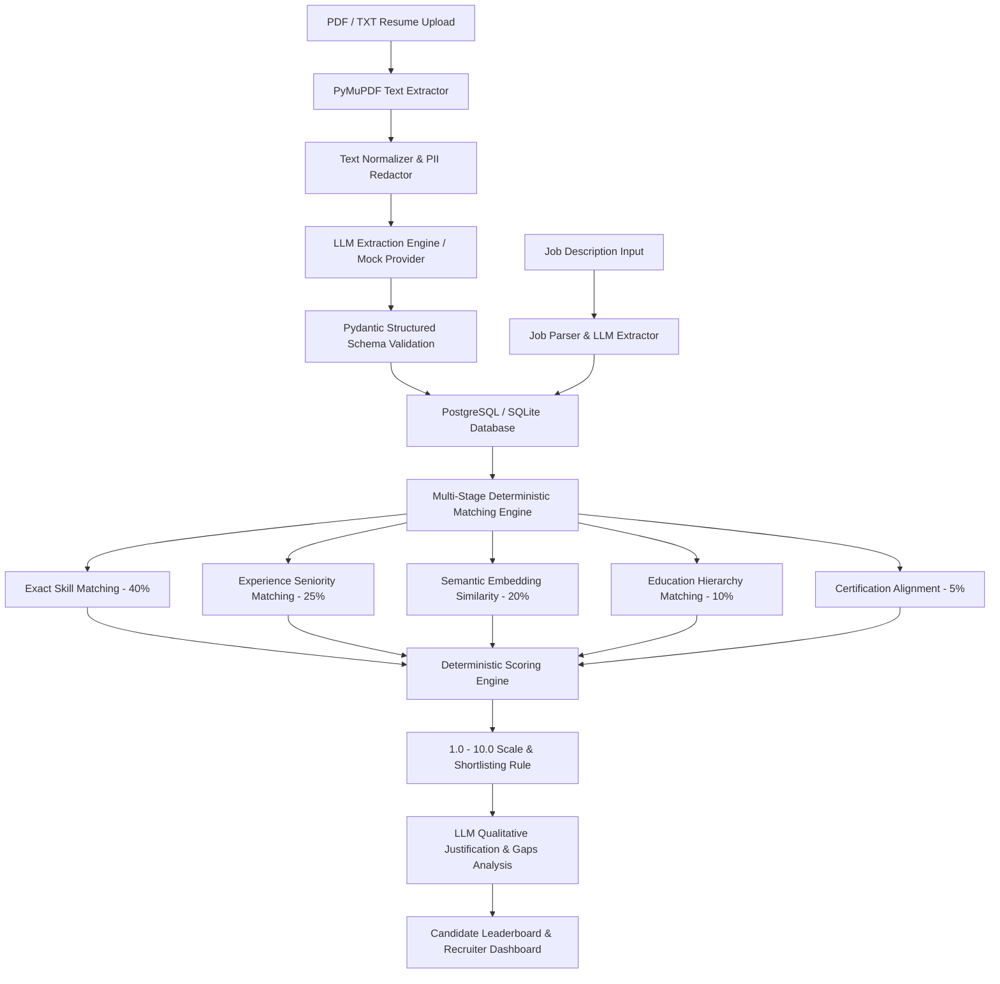

# System Architecture & Technical Specification

## Overview

The **Smart Resume Screener** is an AI-powered resume screening, candidate parsing, deterministic matching, and ranking platform built for recruiters and talent acquisition teams.

---

## Key Subsystems

### 1. Ingestion & Preprocessing
- **PyMuPDF (`fitz`) Text Extraction**: Fast, high-accuracy text extraction from multi-page PDFs, with immediate detection for encrypted, empty, or scanned image-only documents.
- **Section Segmentation**: Heuristically detects standard sections (`summary`, `skills`, `experience`, `education`, `projects`, `certifications`).
- **Fairness & Demographic Redaction**: Automatically filters protected personal attributes (gender, age, marital status, religion, caste, nationality) before scoring.

### 2. Provider Abstraction (`LLMProvider`)
- **`OpenAIProvider`**: Production implementation calling GPT-4o-mini with structured JSON mode and retry backoff.
- **`MockLLMProvider`**: High-fidelity offline engine providing instant extraction, realistic evaluation, and zero external costs.
- **`json_parsing.py`**: Fault-tolerant JSON parser repairing markdown fences, trailing commas, and partial responses without crashing batches.

### 3. Multi-Stage Matching & Deterministic Scoring
- **Stage 1**: Exact Token Matching (Normalized strings, casing, punctuation).
- **Stage 2**: Semantic Cluster Matching (Technology aliases & family mappings, e.g. `FastAPI` -> `Python Web`, `Postgres` -> `SQL Database`).
- **Stage 3**: Experience Matching (Verified career duration vs required seniority).
- **Stage 4**: Education Matching (PhD > Master's > Bachelor's > Associate/None).
- **Stage 5**: Certification Matching (Industry credential alignment).
- **Stage 6**: LLM Evaluation (Qualitative commentary only - numeric scores remain strictly deterministic).

### 4. Recruiter Dashboard
- Built with React 18, TypeScript, Tailwind CSS, and Lucide icons.
- 6 Route Pages: Dashboard, Create Job, Job Details, Upload Resumes, Candidate Rankings Leaderboard, Candidate Inspection Details.
